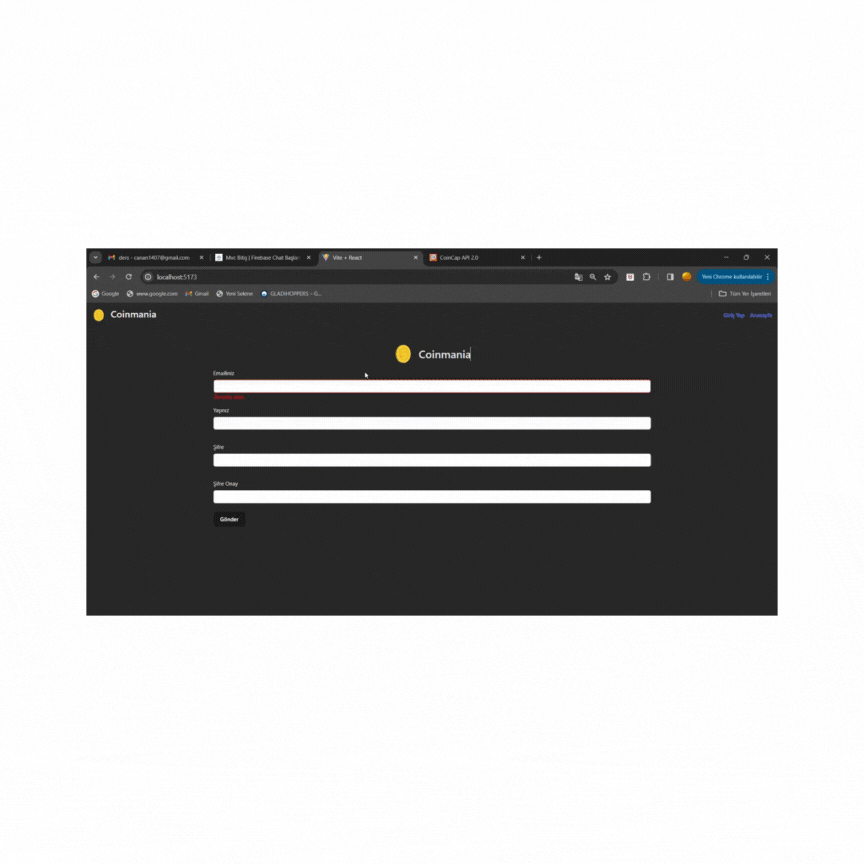

# Coin_MVC_Formik

# home page
💰 Coinmania

💸 This project, Coinmania, is a React-based application that enables real-time tracking of cryptocurrencies and is developed based on Model-View-Controller (MVC) architecture. 
💷 With the project, users can see the latest prices, market volumes and daily exchange rates. 
💶 The reliability of the data Coinmania provides to its users and its user-friendly interface can increase the popularity of the platform. In addition, the fact that users can also follow news and analyses on cryptocurrencies can make the platform a more comprehensive resource.
💴 There is a home page with detailed information and price charts of all cryptocurrencies. 
💵 There is a detail page with detailed information and price chart of each cryptocurrency. 
There is a login page where users can log in to the system
 
# 🛠 Technologies Used: 
⚛ bootstrap
⚛ formik
⚛ yup
⚛ react-router-dom
⚛ axios
⚛ chart.js
⚛ react-chartjs-2
⚛ react-icons
⚛ millify

# Coin_MVC_Formik Project

